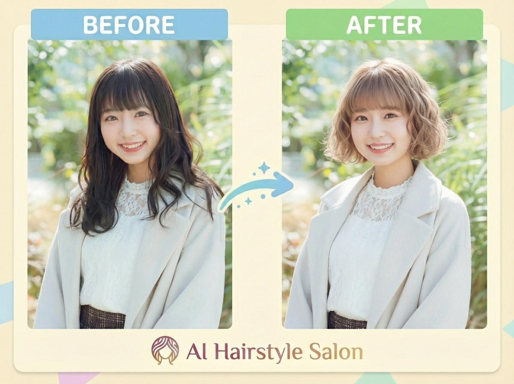
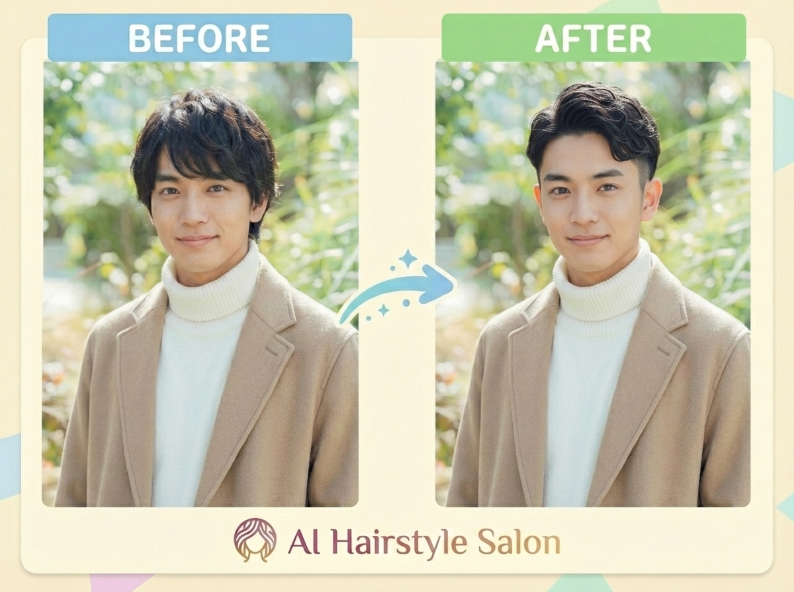
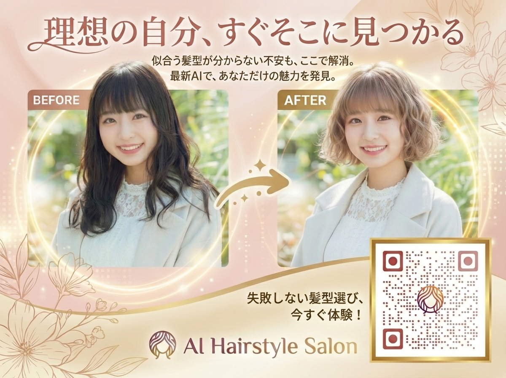
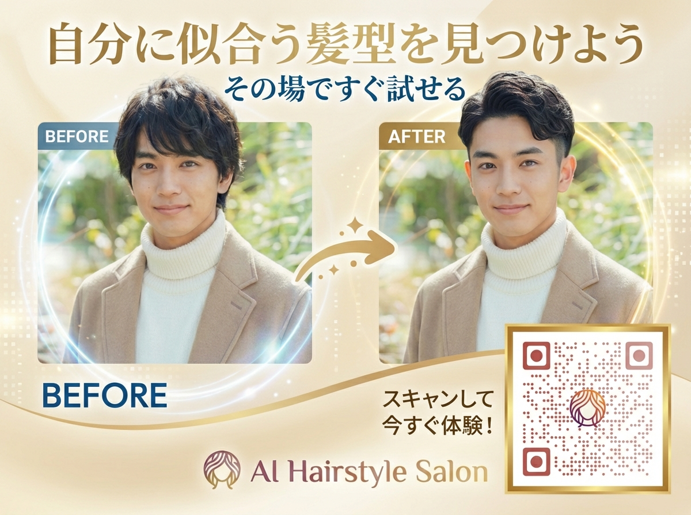

# AI Hairstyle Salon ケーススタディ

## エグゼクティブサマリー

AIを活用した髪型シミュレーションWebアプリ「AI Hairstyle Salon」の開発から美容院への実店舗導入までの全工程を記録したケーススタディ。Google Gemini APIによる画像生成技術を活用し、約3ヶ月（約300時間）・647コミットで本番運用レベルのサービスを構築。VSCodeの使い方もわからない状態からのスタートだったが、Claude Code（AI開発支援ツール）を全面活用することで、決済・認証・テストを含む商用品質のアプリケーションを個人で実現した。API費用ゼロ（Google AI Studio無料枠）で開発・運用。

---

## 1. プロジェクト概要

| 項目 | 内容 |
|------|------|
| プロダクト名 | AI Hairstyle Salon |
| サイト | https://ai-hairstyle-salon.com |
| コンセプト | 「なりたい自分への後押し」— 髪を切る前にAIでシミュレーション |
| 開発者 | KUMANO AI STUDIO |
| 開発期間 | 2025年9月29日 〜 2025年12月31日（約3ヶ月・約300時間） |
| 規模 | 647コミット、30+コンポーネント |
| 導入先 | 海田町の美容院（QRコード広告設置） |
| API費用 | ¥0（Google AI Studio無料枠） |

### 解決する課題
- 髪型を変えたいが失敗が怖い（切ったら戻せない）
- 美容師とのイメージ共有が言葉だけでは難しい
- 事前に「自分の顔で」シミュレーションできるツールがない

---

## 2. 技術構成

### 技術スタック

| レイヤー | 技術 |
|---------|------|
| フロントエンド | React 19 + TypeScript + Vite 6 + Tailwind CSS |
| バックエンド | Firebase (Authentication / Firestore / Cloud Functions / Storage) |
| AI | Google Gemini API（画像生成・画像編集） |
| 決済 | Stripe（サブスクリプション + 都度課金） |
| テスト | Vitest + Playwright + MSW |
| ホスティング | Firebase Hosting + Cloud Functions |
| ドメイン | お名前.com |

### システム構成

```
ユーザー（ブラウザ）
  ↓ 写真アップロード + 髪型選択
フロントエンド（React + Vite / Firebase Hosting）
  ↓ Cloud Functions呼び出し
Firebase Cloud Functions
  ├→ Firestoreからプロンプト設定を取得
  ├→ Gemini APIに画像＋プロンプト送信
  ├→ クレジットのアトミック操作（予約→消費/返却）
  └→ 生成結果をFirebase Storageに保存
  ↓ 結果を返却
フロントエンド
  ↓ Before/After表示
ユーザー
```

### AI画像生成の仕組み

- **モデル**: Google Gemini（画像生成対応モデル）
- **方式**: ユーザー写真＋プロンプトをGemini APIに送信し、髪型を変換した画像を受け取る「直接指示方式」
- **プロンプト管理**: Firestoreで動的管理。髪型ごとにプロンプト・temperature・seed・topK・topP等のパラメータを個別設定。管理画面からリアルタイムで調整可能（デプロイ不要）
- **髪型の限定**: LLMが安定して再現できるワード（high fade sides、long layered hair等）に限定することで、生成品質を担保

### セキュリティ設計

- **プロンプト秘匿**: フロントエンドにプロンプトを持たず、Firebase Cloud Functions経由でのみGemini APIと通信
- **不適切画像対策**: Gemini APIのセーフティフィルター＋アプリ側でエラーカウント・利用制限
- **決済安全性**: Stripe Webhookの冪等性をprocessedWebhookEventsコレクションで担保

---

## 3. 開発プロセス

### 開発タイムライン

| 時期 | マイルストーン |
|------|-------------|
| 2025/9/29 | 開発着手（VSCodeの使い方もわからない状態からスタート） |
| — | MVP開発（写真アップロード→AI変換→結果表示） |
| — | 認証・決済・管理画面の実装 |
| — | テスト整備（Vitest + Playwright） |
| 2025/12/31 | 最終コミット（647コミット到達） |
| 2026/1 | QRコード広告作成・美容院への紹介 |
| 2026/2 | 美容院へのQRコード設置・導入 |

### Claude Code活用による開発効率化

VSCodeの使い方すら知らない状態から、Claude Code（VSCode統合のAI開発ツール）でほぼ全てのコーディングを実施。特に効果が大きかった領域:

1. **Firebase Cloud Functionsの実装** — Stripe Webhook処理、クレジット管理のアトミック操作など、バックエンドロジックの構築
2. **30+コンポーネントのReact UI構築** — 一貫したデザインシステムでの大量コンポーネント生成
3. **テストコード作成** — Vitest（ユニット）+ Playwright（E2E）+ MSW（モック）の三層テスト
4. **初めて触る技術の実装** — Stripe決済統合、Googleログイン、Firebase Cloud Functions等、学習と実装を同時進行

### 技術的チャレンジと解決策

| チャレンジ | 解決策 |
|-----------|--------|
| **髪型が変わらない問題** | スキンヘッド方式 → 参考画像方式 → 最終的にLLMが安定再現可能な髪型に限定する「直接指示方式」に到達 |
| **プロンプト調整のループが遅い** | プロンプトをFirestoreで動的管理する仕組みを構築。デプロイ不要でリアルタイム調整可能に |
| **クレジットの二重課金防止** | Firestoreトランザクションによるアトミック操作（available → reserved → consumed / released） |
| **Stripe Webhookの冪等性** | processedWebhookEventsコレクションで処理済みイベントを管理 |
| **不適切画像のアップロード対策** | Gemini APIのセーフティフィルター＋アプリ側でエラーカウント・利用制限 |
| **プロンプトの秘匿** | フロントエンドにプロンプトを持たず、Cloud Functions経由でのみGemini APIと通信 |

---

## 4. 導入実績

### 導入先
- 広島県海田町の美容院にQRコード広告（男性用・女性用の2種）を設置
- 来店客がスマートフォンでQRコードを読み取り、その場で髪型シミュレーションを体験できる環境を構築

### Before/After 変換例

| 女性の変換例 | 男性の変換例 |
|------------|------------|
|  |  |

### QRコード広告（店舗設置用ディスプレイ）

| 女性向け | 男性向け |
|---------|---------|
|  |  |

### フィードバック

**美容師からの反応:**
> 「すごい」と評価。ただし「この通りに髪を切れるわけではない」という点で、顧客への見せ方に慎重な面もあった。

**友人・知人での検証:**
> かなり役に立つとの評価。特に「思い切ってイメチェンしたいとき」に事前シミュレーションできる点が好評。「イメチェンに踏み出すには必須」という声も。

### 現状の課題
- 美容院での実際の利用頻度はまだ低い（定着に至っていない）
- 「AIの出力 = 実際の仕上がり」ではないことの伝え方が課題
- 利用回数・アクセス数の計測が未整備

---

## 5. 学び・気づき

### 技術面
- AI画像生成は「何でもできる」わけではなく、**安定して再現できる範囲を見極めて限定する**ことが品質の鍵
- プロンプトをコードにハードコードせず、**管理画面で動的に調整できる仕組み**にすることで、改善サイクルが劇的に高速化
- Claude Codeの活用により、**プログラミング未経験でも商用品質のアプリケーション**（認証・決済・テスト完備）を約3ヶ月で構築可能

### ビジネス面
- 開発できることと、実際に使ってもらえることの間には大きなギャップがある
- 美容師の「この通りには切れない」という懸念は正当 — AIシミュレーションの位置づけ（参考情報）を明確にする必要がある
- 「無料で髪型シミュレーションできるお店」という差別化ポイントが店選びの一要素になる可能性がある

---

## 6. ビジネスインパクト

### 開発コスト

| 項目 | コスト |
|------|-------|
| AI API費用 | ¥0（Google AI Studio無料枠） |
| 開発所要時間 | 約300時間（3ヶ月） |
| ホスティング | Firebase無料枠（Spark） |
| ドメイン | お名前.com（年額数千円） |
| 決済手数料 | Stripe標準手数料（利用時のみ） |

### 美容院側のメリット
- **顧客満足度向上**: 事前に髪型を試せることで失敗リスクが軽減される
- **カウンセリング効率化**: 「こういう感じにしたい」を画像で共有でき、美容師との意思疎通が改善
- **集客の差別化**: 「このお店ならAIで事前シミュレーションできる」が来店動機の一つになりうる

### 横展開の可能性
- 現時点では積極的な横展開は未計画
- ただし「AIで事前シミュレーションできるお店」が店選びのポイントになるなら、他の美容院への展開余地あり
- 美容院以外の業種（メガネ、メイク、ファッション等）への応用可能性も技術的には存在

---

## 付録

### 関連リンク
- [AI Hairstyle Salon](https://ai-hairstyle-salon.com)
- [生成AI-LT広島vol.2 発表記事（note）](https://note.com/aitsukai_kumano/n/n9e5cae6c3880)

### 関連タスク
- 1-C-05-1: AI Hairstyle Salon開発・公開（完了）
- 1-C-05-2: 美容院導入・QRコード広告設置（完了）
- 1-C-05-3: 生成AI-LT広島vol.2 発表資料作成（完了）
- 1-C-05-4: 成果の記録・ポートフォリオ化（本ドキュメント）
