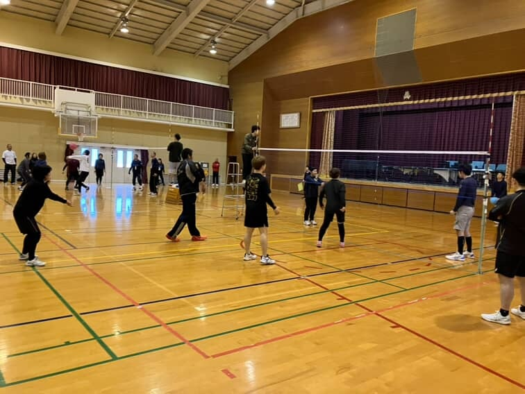
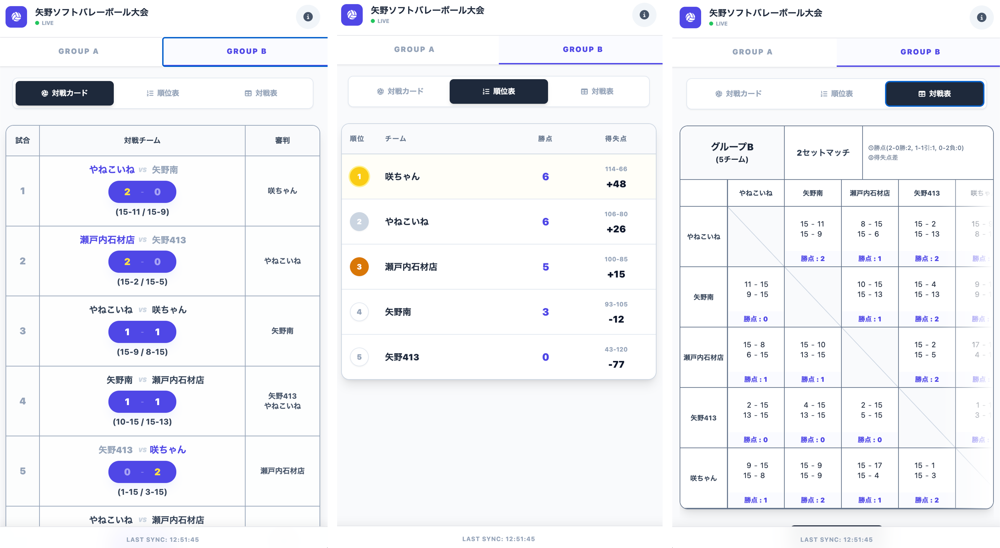
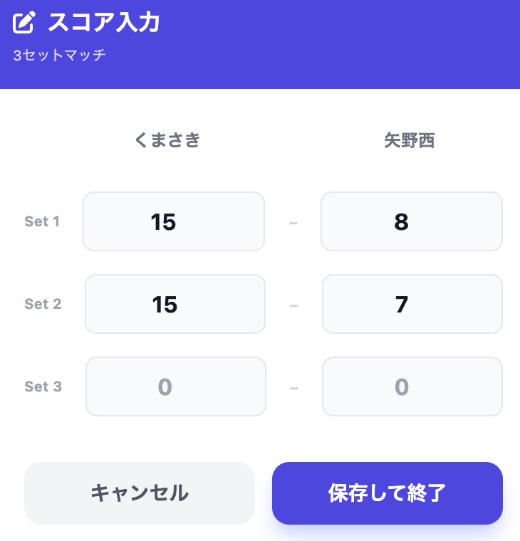
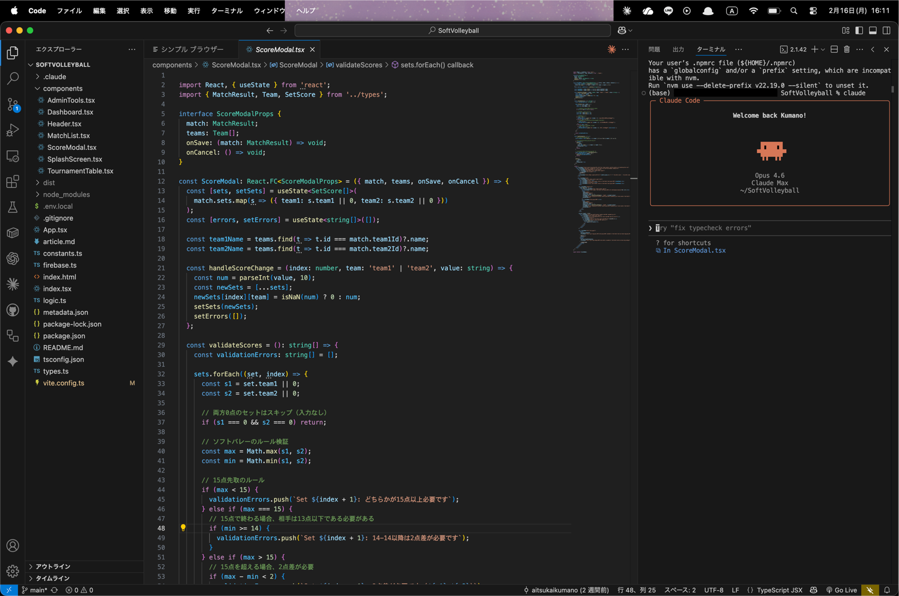
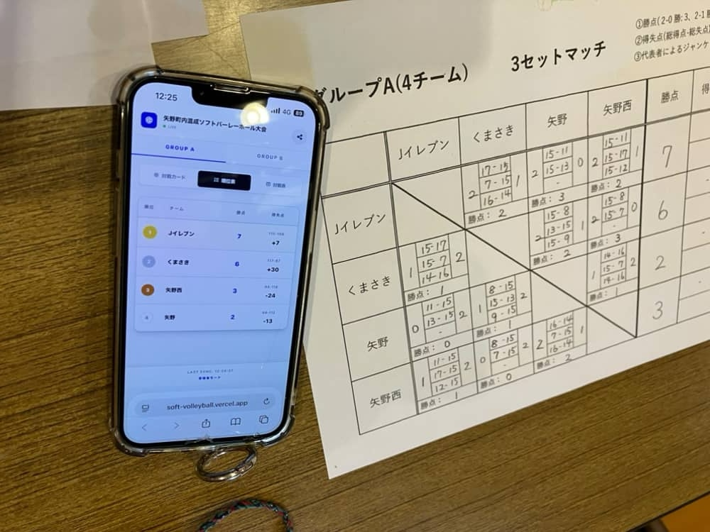

# ソフトバレー大会スコアアプリ ケーススタディ

## エグゼクティブサマリー

地域のソフトバレーボール大会のスコア管理をデジタル化するWebアプリを開発し、実際の大会で運用した事例。Firebase Realtime Databaseによるリアルタイム同期で、約60名の参加者全員がスマートフォンから試合結果を即座に確認できる環境を実現。Claude Code（AI開発支援ツール）を全面活用し、約10時間・27コミットで本番運用レベルのアプリケーションを構築した。

---

## 1. プロジェクト概要

| 項目 | 内容 |
|------|------|
| プロダクト名 | ソフトバレー大会スコアアプリ |
| サイト | https://soft-volleyball.vercel.app |
| コンセプト | 「スマホで結果がすぐわかる大会」— 紙に頼らないスコア共有 |
| 開発者 | KUMANO AI STUDIO |
| 開発期間 | 約10時間 |
| 規模 | 27コミット、15コアファイル |
| 運用実績 | 2026年2月15日 矢野体育館ソフトバレーボール大会（約60名参加） |
| 運用コスト | ¥0（Firebase無料枠 + Vercel無料枠） |

### 大会の様子



### 解決する課題
- 対戦表の作成・管理が手作業で負担が大きい
- 試合結果を参加者に共有する手段がない（掲示板まで見に行く必要がある）
- 順位計算を手動で行うためミスが起きやすい

---

## 2. 技術構成

### 技術スタック

| レイヤー | 技術 |
|---------|------|
| フロントエンド | React 19 + TypeScript + Vite 6 + Tailwind CSS |
| バックエンド | Firebase Realtime Database（サーバーレス） |
| ホスティング | Vercel |
| アイコン | Font Awesome（CDN） |
| 画像生成 | html-to-image（対戦表のPNG保存） |

### システム構成

```
参加者（スマートフォン）
  ↓ QRコードでアクセス
フロントエンド（React SPA / Vercel）
  ↓ Firebase Realtime Database（onValueリスナー）
  ↕ リアルタイム同期
管理者（スマートフォン / ?role=admin）
  ↓ スコア入力・更新
Firebase Realtime Database
  → 全端末に即時反映
```

### リアルタイム同期の仕組み
- **データベース**: Firebase Realtime Database
- **同期方式**: `onValue`リスナーによるリアルタイム同期。管理者がスコアを入力すると、全参加者の画面に即時反映
- **ロール管理**: URLクエリパラメータ（`?role=admin`）で管理者/一般を分離。管理者のみ書き込み可能、一般ユーザーは閲覧専用

---

### アプリ画面



---

## 3. 機能一覧

| 機能 | 説明 |
|------|------|
| リアルタイムスコア同期 | Firebase Realtime Databaseで複数端末に即時反映 |
| 対戦カード表示 | グループ別の試合一覧（試合番号・チーム名・審判・セットスコア） |
| スコア入力モーダル | 管理者がセットごとのスコアを入力・更新 |
| 順位表（勝点自動計算） | グループA（3セットマッチ）とグループB（2セットマッチ）で異なる勝点ルールに対応 |
| 対戦表（総当たり表） | 全チーム間の対戦結果をマトリクス形式で表示 |
| 対戦表の画像保存 | html-to-imageで対戦表をPNG画像としてダウンロード |
| グループ切り替え | グループA（4チーム）とグループB（5チーム）をタブで切り替え |
| 管理者モード | URLパラメータで分離。スコア編集・データリセットが可能 |
| スマホ対応 | モバイルファーストのレスポンシブUI |

### スコア入力画面（管理者モード）



---

## 4. 開発プロセス

### 開発タイムライン

| 時期 | マイルストーン |
|------|-------------|
| 2026/2（大会数日前） | 開発着手。「対戦表を作らないといけない」という課題からスタート |
| — | MVP開発（対戦カード表示・スコア入力・順位計算） |
| — | Firebase Realtime Database移行・リアルタイム同期実装 |
| — | 対戦表画像保存・スプラッシュスクリーン等の追加機能 |
| 2026/2/15 | 矢野体育館ソフトバレーボール大会で本番運用（約60名） |

### Claude Code活用による開発効率化

設計・実装・UIデザイン・バグ修正のほぼ全工程でClaude Codeを使用。特に効果が大きかった領域:

1. **Firebase Realtime Database移行** — ローカルデータからFirebaseへの移行をAIと対話しながら構築
2. **リアルタイム同期の実装** — `onValue`リスナーによる複数端末の即時同期
3. **グループ別の勝点ロジック** — 3セットマッチと2セットマッチで異なるルールへの対応
4. **対戦表の画像保存** — html-to-imageライブラリを使ったPNG出力

### 開発環境（VS Code + Claude Code）



### 開発効率のポイント

| 指標 | 内容 |
|------|------|
| 開発時間 | 約10時間 |
| コミット数 | 27 |
| コアファイル数 | 15 |
| 1機能あたりの開発時間 | 約1時間（主要10機能） |

---

## 5. 運用実績

### 大会概要
- **大会名**: 矢野ソフトバレーボール大会
- **日時**: 2026年2月15日
- **会場**: 矢野体育館
- **参加者**: 約60名
- **構成**: グループA（4チーム・3セットマッチ）、グループB（5チーム・2セットマッチ）

### 運用方法
- 紙の得点管理とアプリを**併用**して運用
- 管理者がスコアをアプリに入力 → 参加者はスマートフォンでリアルタイムに確認
- 対戦表はPNG画像として保存・共有

### Before/After



| 項目 | Before（従来） | After（アプリ導入） |
|------|---------------|-------------------|
| 結果確認 | 掲示板まで見に行く必要あり | スマホでどこからでも即確認 |
| 対戦表作成 | 手作業で作成 | アプリが自動生成 |
| 順位計算 | 手動計算（ミスの可能性） | 勝点ルールに基づき自動計算 |
| 結果共有 | 大会終了後に口頭or紙 | 画像保存して即共有可能 |

---

## 6. 学び・気づき

### 技術面
- Firebase Realtime Databaseの`onValue`リスナーにより、**サーバーを立てずにリアルタイム同期**を実現できる
- React + TypeScript + Vite構成なら、**10時間で本番運用可能なアプリ**をClaude Codeと一緒に構築できる
- グループ別の勝点ルールなど、**ドメイン固有のロジック**もAIに説明すれば正しく実装できる

### ビジネス面
- 「対戦表を作らないといけない」という**小さな困りごとがDXの入り口**になる
- 紙との併用から始めることで、**デジタル化への抵抗感を下げる**ことができる
- 約60名が実際に使った実績は、**他の地域イベントへの横展開の説得材料**になる

---

## 7. ビジネスインパクト

### 開発コスト

| 項目 | コスト |
|------|-------|
| 開発所要時間 | 約10時間 |
| Firebase | ¥0（無料枠） |
| Vercel | ¥0（無料枠） |
| ドメイン | なし（Vercelサブドメイン） |

### 大会運営側のメリット
- **参加者の利便性向上**: スマホで結果を即確認できるため、掲示板の前に集まる必要がない
- **運営負荷の軽減**: 順位計算・対戦表作成が自動化
- **記録の残しやすさ**: 対戦表を画像で保存・共有可能

### 横展開の可能性
- 他のソフトバレー大会、バドミントン大会など地域スポーツイベントへの展開
- チーム数・セット数・勝点ルールのカスタマイズで汎用化可能
- 「10時間で作れる」という実績が、他の地域課題解決の提案にも活きる

---

## 付録

### 関連リンク
- [ソフトバレースコアアプリ](https://soft-volleyball.vercel.app)
- [note記事: 地域のスポーツ大会をAIでDX](https://note.com/aitsukai_kumano/n/n2cdb2ac2e3d7)

### 関連タスク
- 1-C-02-1: ソフトバレー大会でのアプリ運用（完了）
- 1-C-02-2: ソフトバレー大会ポートフォリオ化（本ドキュメント）
