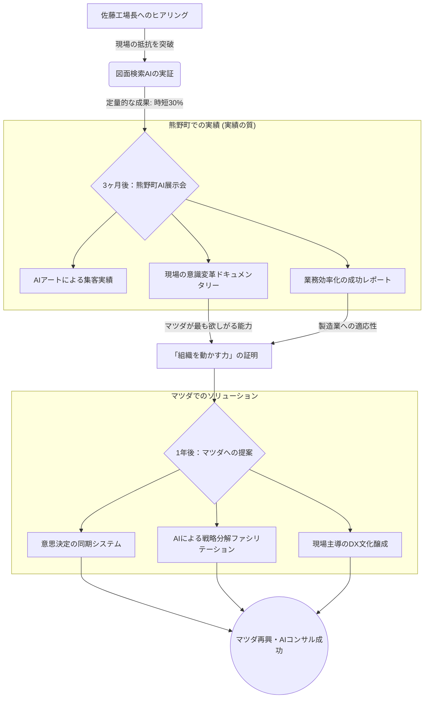

# 全体目標への接続図 (Strategic Alignment Map)

この図は、今目の前にある「佐藤工場長との対話」が、どうやって「マツダの救済」に繋がるかを示したものです。

### なぜ、今「佐藤さん」なのか？
1. **「縮図」としての佐藤さん**: 佐藤さんが抱える「変化への恐怖」や「職人の自負」は、マツダの部長やマネージャーが抱えているものと同じです。
2. **「証拠」としての佐藤さん**: 「元社員のdaiki」として提案するのではなく、「熊野町の頑固な職人を納得させて結果を出したコンサルタント」として提案するためです。
3. **「システム」の種**: 佐藤さんと作った「AIは弟子」という考え方は、そのまま大企業の「部下教育・技術継承」のソリューションにスケールアップできます。

**結論：**
今、daikiさんが図面を1枚預かることは、マツダの巨大な組織を動かすための「レバー（梃子）」を握る最初のアクションです。
