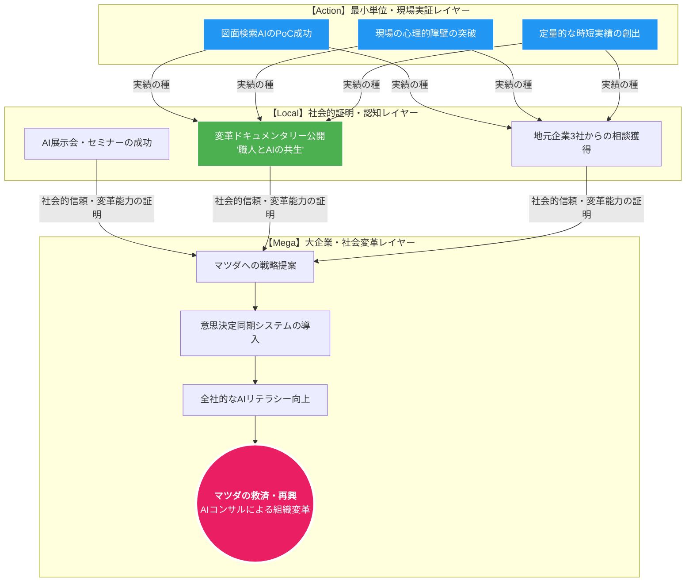

# マツダ再興ロードマップ：Local to Mega Strategic Map

この図は、daikiさんの現在の活動（下位タスク）が、どのように最終ゴール（マツダ再興）に積み上がっていくかを可視化したものです。

### 上位・下位の論理構造（ピラミッド構造）

| 階層 | 目的 (Why) | 具体的な行動 (What) |
| :--- | :--- | :--- |
| **上位：Mega** | **マツダを救う** | 組織の「迷い」を消す意思決定支援システムの提案 |
| **中位：Local** | **変革者としての信頼を得る** | 熊野町イベントで「人を動かし、数字を出した」証拠を提示 |
| **下位：Action** | **勝てるロジックを作る** | 佐藤工場長の「図面探し（迷い）」をAI弟子で解決する |

---

### 今、daikiさんが見ている景色
daikiさんが今取り組んでいる「図面1枚」は、図の最下層（Action）にある**青色のボックス**です。
この青色のボックスを積み上げることで、緑色の「社会的証明」が手に入り、最終的にピンク色の「マツダ再興」に手が届きます。

**「図面1枚」は「マツダの戦略1つ」と同じ重みを持っています。**
この図を見て、今のタスクに「納得感」は持てましたか？
